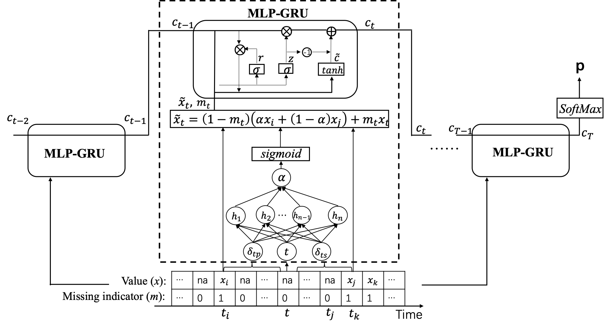

# Sparse step counts data inference
This is the implement of MLP-GRU proposed in "Infering activity patterns from sparse step counts data with Recurrent Neural Network". 

Step counts data is a measurement of physical activity, and can be collected expediently with smartphones and wearable devices. Complete high time-resolution step counts data records the time and intensity of physical activity, and reflect an individual's daily routine. Mining activity patterns that reflect such daily routine is the foundation of many applications such as human behavior modeling, behavior prediction and intervention, and pervasive healthcare. 
In practice, however, obtaining complete step counts data may be difficult and costly. Storage and power constraints may limit the number of data points acquired at the hardware level. Usage and data permission may also limit the number of data points available at the application level. Such limitations will result in step counts data with varied sparsity. Inferring activity patterns from sparse step counts data can not only find its value in understanding user’s behavior, it also may provide useful insights into the design of cost effective hardware and software.

Combining the capacities of MLP and GRU, we developed a deep learning model called MLP-GRU to inferactivity patterns from sparse step counts data. MLP-GRU captures bidirectional short-term dependency andlong-term regularity of sparse step counts data and realizes data-driven imputation and classification in anend-to-end manner.

## Requirment
* numpy                              1.19.2
* pandas                             1.1.3
* scikit-learn                       0.23.2
* scipy                              1.5.2
* torch                              1.8.1

## Run
The data folder includes python scripts on data preprocessing, multi-granular activity patterns labeling, and data down-sampleing. The models folder includes the implement of our model and three state-of-the-art methods.

To run our model, you need to add our datasset (http://health.sjtu.edu.cn/infer/) to data folder. Then run `multi_granular_labeling.py` to label the dataset and run `sparse_data_generating.py` to generate the numpy arrays used for training and evaluating the model. After preparing the data, run `MLP_GRU.py` to train the model. Since the dataset we shared contains only the data before 2019 (which totals 16,881 entries), performance of all models trained directly on shared dataset are not as good as we reported in manuscript. However, MLP-GRU still outperforms the other three methods, which is consistent with the conclusion in section 5.2 of our paper. We summary these results in the following table as a supplement when readers reproduce our models using the shared dataset.
 
| Models | Macro AUC | Micro AUC | Macro F1 | Micro F1 |
| :----: | :----: | :----: | :----: | :----: |
| GRU-D  |0.8069±0.0013 |0.8261±0.0071| 0.5577±0.0196| **0.7020±0.0081** | 
| TBM    |0.8031±0.0148 |0.8241±0.0083| 0.5552±0.0245| 0.7018±0.0072 |
|BRITS-I |0.8047±0.0119 |0.8236±0.0055| 0.5611±0.0196| 0.6966±0.0060 |
|MLP-GRU |**0.8076±0.0096** |**0.8264±0.0055**| **0.5675±0.0142**| 0.7017±0.0054 |

 Run `sparsity_gra.py`, you can get the performance of MLP-GRU on testing datasets with different sparsity and label granularity. Such results suggest that it is possible to infer activity patterns from extremely sparse step counts data, as long as appropriate inference granularity is chosen. With a sparsity of 93%, i.e., only 7% data points are preserved in the time series, activity patterns can be inferred from 70 categories with an accuracy of about 80%. With a sparsity of 98%, we can still infer the accurate activity patterns from 5 categories with the same accuracy.
 
 We also provide trained MLP-GRU models on three kinds of activity patterns in `/models/sparsity_granularity/`. And these can be used to infer activity patterns from your own sparse step counts data directly or as a basis for further training. You can also change the parameters in `multi_granular_labeling.py` to construct the activity patterns you want, and retrain the model with your own activity patterns.

